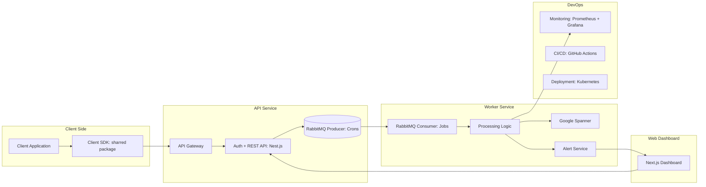

# Middle Full-Stack engineer test assessment - Description of the BE + FE Application Architecture

## Task overview

You need to prepare a document describing how you would design an error logging service from scratch. Explain which technologies you would choose for the client library (SDK), backend API, database, web dashboard, and DevOps solution, and justify why these choices are optimal. Additionally, compile a list of questions you would ask the client to better understand the project requirements and expectations.

### 🏗️ System Architecture

## 🛠️ Technology Stack

| Component          | Purpose                                             | Technology / Tool                        | Language       |
|-------------------|----------------------------------------------------|-----------------------------------------|---------------|
| Client SDK         | Collect and send error logs from applications     | TypeScript SDK (npm package)             | TypeScript    |
| API Gateway        | Entry point for incoming SDK and Dashboard requests | Nginx / Cloud Load Balancer             | —             |
| API Service        | Handles authentication, REST API, and message publishing | Nest.js + Express + RabbitMQ producer | TypeScript    |
| Message Queue      | Decouples ingestion from processing               | RabbitMQ                                  | —             |
| Worker Service     | Consumes jobs, processes logs, stores to DB       | Node.js Worker + BullMQ / amqplib       | TypeScript    |
| Primary Database   | Scalable structured storage for logs and metadata | Google Cloud Spanner                     | SQL (Spanner Dialect) |
| Alert Service      | Triggers alerts based on severity                 | Node.js microservice + Email / Slack SDK    | TypeScript    |
| Web Dashboard      | User interface for viewing, filtering, and analyzing logs | Next.js + React + TailwindCSS          | TypeScript    |
| DevOps / Monitoring| CI/CD, deployment, and observability             | GitHub Actions, Kubernetes, Prometheus, Grafana | —        |
