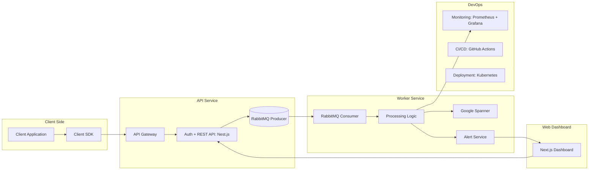

# Middle Full-Stack engineer test assessment - Description of the BE + FE Application Architecture

## Task overview

You need to prepare a document describing how you would design an error logging service from scratch. Explain which technologies you would choose for the client library (SDK), backend API, database, web dashboard, and DevOps solution, and justify why these choices are optimal. Additionally, compile a list of questions you would ask the client to better understand the project requirements and expectations.

### 🏗️ System Architecture

