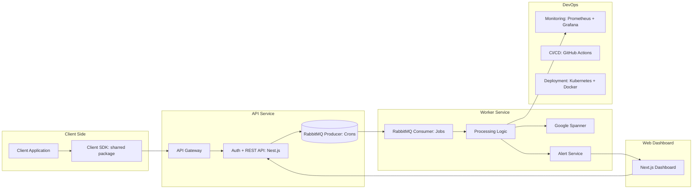

# Middle Full-Stack engineer test assessment - Description of the BE + FE Application Architecture

## Task overview

You need to prepare a document describing how you would design an error logging service from scratch. Explain which technologies you would choose for the client library (SDK), backend API, database, web dashboard, and DevOps solution, and justify why these choices are optimal. Additionally, compile a list of questions you would ask the client to better understand the project requirements and expectations.

### 🏗️ System Architecture

## 🛠️ Technology Stack

| Component          | Purpose                                             | Technology / Tool                        | Language       |
|-------------------|----------------------------------------------------|-----------------------------------------|---------------|
| Client SDK         | Collect and send error logs from applications     | TypeScript SDK (npm package)             | TypeScript    |
| API Gateway        | Entry point for incoming SDK and Dashboard requests | Nginx / Cloud Load Balancer             | —             |
| API Service        | Handles authentication, REST API, and message publishing | Nest.js + Express + RabbitMQ producer | TypeScript    |
| Message Queue      | Decouples ingestion from processing               | RabbitMQ                                  | —             |
| Worker Service     | Consumes jobs, processes logs, stores to DB       | Node.js Worker + BullMQ / amqplib       | TypeScript    |
| Primary Database   | Scalable structured storage for logs and metadata | Google Cloud Spanner                     | SQL (Spanner Dialect) |
| Alert Service      | Triggers alerts based on severity                 | Node.js microservice + Email / Slack SDK | TypeScript    |
| Web Dashboard      | User interface for viewing, filtering, and analyzing logs | Next.js + React + TailwindCSS          | TypeScript    |
| DevOps / Monitoring| CI/CD, deployment, and observability             | GitHub Actions, Kubernetes, Prometheus, Grafana, Docker | —        |

---

## 💡 Technology Choice Justification

- **TypeScript stack**: Enables faster development, strong typing, and full-stack consistency (SDK, API, Worker, Dashboard).  
- **Nest.js + Node.js**: Modular architecture, dependency injection, and rapid API development.  
- **RabbitMQ**: Reliable asynchronous queue to decouple ingestion and processing.  
- **Google Cloud Spanner**: Globally scalable, strongly consistent database, ideal for structured logs with high write throughput.  
- **Next.js + React + TailwindCSS**: Rapid frontend development with server-side rendering and modern UI components.  
- **Prometheus + Grafana**: System and service monitoring for observability.  
- **GitHub Actions + Kubernetes**: CI/CD pipeline and scalable deployment solution.  

**Priorities addressed:** development speed, high throughput processing, availability of skilled developers, and personal comfort with TypeScript stack.

---

## ⚙️ Key Design Decisions

1. **Real-time processing**:  
   - SDK batches logs → API → RabbitMQ → Worker → Spanner → Alert Service.  
   - Alerts trigger via Slack/Email on critical errors.

2. **Log retention policy**:  
   - Hot storage in Google Spanner for recent logs (e.g., 30 days).  
   - Optional archival of older logs to GCS/S3 for long-term storage and cost optimization.

3. **API rate limits**:  
   - Implemented at API Gateway per project/user token.  
   - SDK supports configurable batching to reduce request frequency and improve throughput.

4. **Security**:  
   - API Key authentication for SDK and API requests.  
   - HTTPS enforced for all endpoints.  
   - Optional PII filtering before sending logs.

5. **DevOps / Scalability**:  
   - Kubernetes auto-scaling for API and Worker pods.  
   - CI/CD pipelines with GitHub Actions.  
   - Prometheus + Grafana for metrics collection, dashboards, and alerting on failures.

---

## ❓ Developer Questions for Platform Owner

1. What is the expected log volume per second or per project?  
2. Should the SDK support mobile apps, server apps, or both?  
3. How long should logs be retained in hot storage?  
4. What alert channels are first priority (Email, Slack, Webhooks)?  
5. Is multi-organization or multi-project support required?  
6. Are advanced analytics or BI tool integrations (BigQuery, Looker) needed?
    
