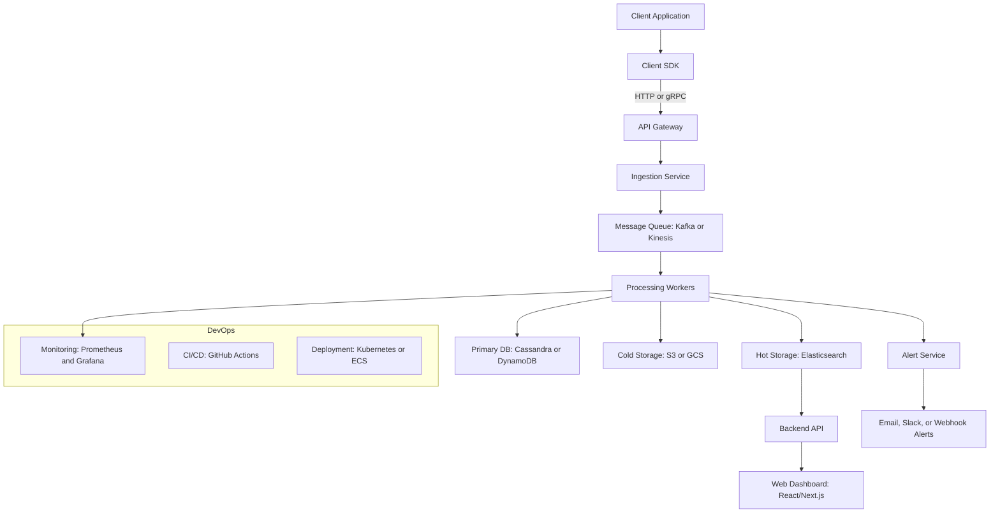

# Middle Full-Stack engineer test assessment - Description of the BE + FE Application Architecture

### 🏗️ System Architecture

```mermaid
graph TD
    A[Client Application] --> B[Client SDK]
    B -->|HTTP or gRPC| C[API Gateway]
    C --> D[Ingestion Service]
    D --> E[Message Queue: Kafka or Kinesis]
    E --> F[Processing Workers]
    F --> G1[Hot Storage: Elasticsearch]
    F --> G2[Primary DB: Cassandra or DynamoDB]
    F --> G3[Cold Storage: S3 or GCS]
    G1 --> H[Backend API]
    H --> I[Web Dashboard: React/Next.js]
    F --> J[Alert Service]
    J --> K[Email, Slack, or Webhook Alerts]
    subgraph DevOps
        L[Monitoring: Prometheus and Grafana]
        M[CI/CD: GitHub Actions]
        N[Deployment: Kubernetes or ECS]
    end
    F --> L
```
